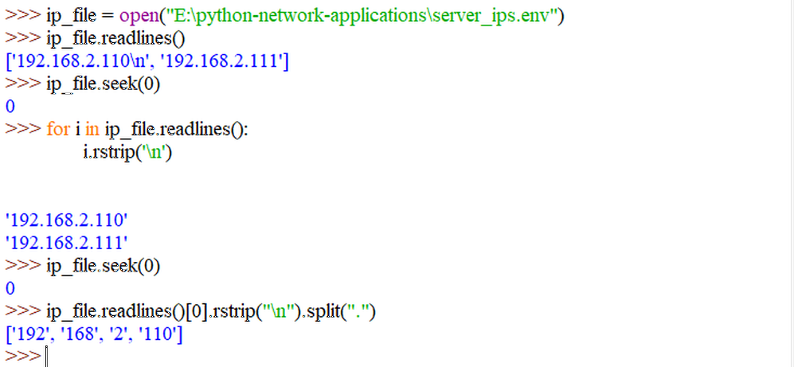
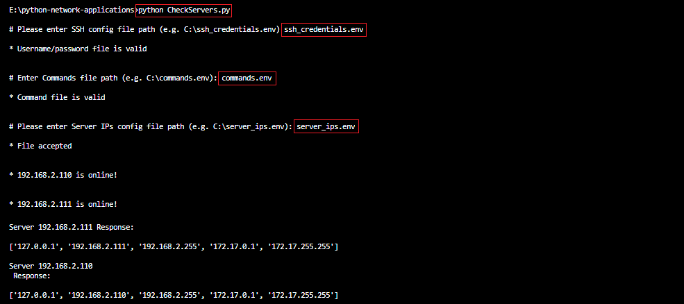

```
....................................................................................................
....................................................................................................
................:???%*..............................................................................
..............???????????...........................................................................
.............??.?????????%..........................................................................
.............?:..???????%%..........................................................................
.............??.%??????%%%..........................................................................
.............?????????%%%%..........................................................................
...................;?%%%%%..........................................@@:.............................
........:????%%%%%%%%%%%%%.::::.............................@@......@@:.............................
.......????????????%%%%%%%.:::::............................@@......@@:.............................
......:???????????%%%%%%%%.:::::,.....@@??@@?..@@@....@@..@@@@@@@...@@:@@@.....;@@@+....@@.@@@......
......???????????%%%%%%%%%.::::::.....@@%@@@@+..@@...@@@..@@@@@@@...@@#@@@@...@@@@@@@...@@@@@@@.....
......??????????%%%%%%%%%%.::::::.....@@@..@@@..@@@..@@:....@@......@@@..@@...@@...@@...@@@.S@@.....
......?????????%%%%%%%%%%.:::::::.....@@@...@@..,@@..@@.....@@......@@+..@@..?@@...@@#..@@...@@.....
......????????,..........::::::::.....@@#...@@...@@.@@@.....@@......@@:..@@..@@@...@@@..@@...@@.....
......??????%..::::::::::::::::::.....@@@...@@...@@@@@......@@......@@:..@@..@@@...@@@..@@...@@.....
......??????.,::::::::::::::::::;.....@@@..S@@....@@@@......@@,.....@@:..@@..:@@...@@;..@@...@@.....
......?????%.::::::::::::::::::;;.....@@@@*@@@....@@@@......@@@??...@@:..@@...@@@.@@@...@@...@@.....
......%???%%.:::::::::::::::::;;;.....@@?@@@@......@@.......*@@@@...@@:..@@....@@@@@....@@...@@.....
.......??%%%.::::::::::::::::;;;......@@?.;,.......@@............................+..................
.......+%%%%.:::::::::::::::;;;.......@@?.........@@*...............................................
.........,,,.::::::,..................@@?.......@@@@................................................
.............:::::::::::::............@@?.......@@?.................................................
.............:::::::::::::..........................................................................
.............:::::::::..;;..........................................................................
.............:::::::::..;;..........................................................................
..............:::::::::;;;..........................................................................
...............:::::::;;............................................................................
....................................................................................................
....................................................................................................
```


# Using Python to Configure LINUX Servers

This program uses the Python library [Paramiko](http://www.paramiko.org) to connect to LINUX servers via SSHv2 and allows you to read status messages as well as to automatically configure a large number of servers to your needs.


<!-- TOC -->

- [Using Python to Configure LINUX Servers](#using-python-to-configure-linux-servers)
  - [Add Server Address](#add-server-address)
  - [Validate IP Address](#validate-ip-address)
  - [Check Reachability](#check-reachability)
  - [Login Credentials and SSH Commands](#login-credentials-and-ssh-commands)
  - [Establishing the SSH Connection](#establishing-the-ssh-connection)
  - [Simultaneous SSH Connections](#simultaneous-ssh-connections)
  - [Building the App](#building-the-app)
  - [Extracting Information from the Response](#extracting-information-from-the-response)
  - [Automate Configurations](#automate-configurations)

<!-- /TOC -->


## Add Server Address

We want to add our server addresses by an `server_ips.env` file and check if the, check if the file exist and read the IP addresses given:


```python
import os.path
import sys

# To connect to the server we want to have the user add a file with the login info
def ip_file_valid():

    # Ask for the config file location holding the IP addresses of your servers
    ip_file = input("\n# Please enter Server IPs config file path (e.g. C:\server_ips.env): ")

    # Use the internal python function os.path to check if the file exists, otherwise exit
    if os.path.isfile(ip_file) == True:
        print("\n* File accepted\n")
    
    else:
        print("\n* {} Not found!\n".format(ip_file))
        sys.exit()

    # Open file for reading
    selected_ip_file = open(ip_file, 'r')
    
    # Start reading from the beginning
    selected_ip_file.seek(0)
    
    # Reading each line - has to be 1 IP address per line file - and write it into a variable
    ip_list = selected_ip_file.readlines()
    
    # Close file
    selected_ip_file.close()
        
    # Return the list of IP addresses
    return ip_list
```

_(see `ip_file_valid.py`)_


The addresses are stored inside the variable `ip_file`, processed into a list and exported as `ip_list`.


## Validate IP Address

We need to check if the IP address is valid and is not part of an restricted IP block:


```python
import sys

#Checking octets
def ip_addr_valid(list):
    # for-loop over all IPs inside the config file
    for ip in list:
        # Every IP had to be written on a new line inside the file so we now have to strip the \n newline character
        ip = ip.rstrip("\n")
        # To see if they are valid IP we split each octet at the . (see ./Python_Net_App_01.png)
        octet_list = ip.split('.')
        # Max 4 octets
        # First octet has to be between 1 and 223, may not be 127 or 169 (reserved IP space)
        # Second octet cannot be 254 (reserved IP space) but has to be between 0-255
        # Between the 1st and 2nd octet we have to use the OR operator to allow for addresses like 169.253.1.1, 10.254.1.1 - only 169.254.x.x is restricted (see ./Python_Net_App_02.png)
        # All other cases have AND conditions
        # Third and Fourth octet has to be between 0-255
        if (len(octet_list) == 4) and (1 <= int(octet_list[0]) <= 223) and (int(octet_list[0]) != 127) and (int(octet_list[0]) != 169 or int(octet_list[1]) != 254) and (0 <= int(octet_list[1]) <= 255 and 0 <= int(octet_list[2]) <= 255 and 0 <= int(octet_list[3]) <= 255):
            continue
             
        else:
            print('\n* Invalid IP address added: {} :(\n'.format(ip))
            sys.exit()
```

_(see `ip_addr_valid.py`)_





The IP addresses are read, stripped of the new line character `/n` and split into their single octets by the `.` separating them.


We now perform a couple of tests to verify the IP addresses - note that all octets are represent by strings and first have to be converted to integer values:

* Each address must have 4 octets
* The first octet has to be between 1-223 (Unicast addresses only)
* The first octet may not be 127 (loopback interfaces)
* The first octet may not be 169 if the second is 254 (169.254.x.x are assigned by Windows to interfaces that require DHCP but are unable to contact a DHCP server) - Note that we have to use the `OR` operator here and not the `AND`
* The second, third and fourth octet can be a number between 0-255


## Check Reachability

Before we open an SSH connection we first want to make sure that the IP addresses can be reached by a ping. This can be handled by the Python library `subprocess`:


```python
import sys
import subprocess

#Check if IP can be pinged
def ip_reach(list):
    # take each IP from the file
    for ip in list:
        # by removing the newline character
        ip = ip.rstrip("\n")
        # and ping the address but suppress the std output or error messages  (see ./Python_Net_App_03.png)
        ping_reply = subprocess.call('ping %s -n 2' % (ip,), stdout=subprocess.DEVNULL, stderr=subprocess.DEVNULL)
        # a reply of 0 (echo reply) means that the ping was successful
        if ping_reply == 0:
            print("\n* {} is online!\n".format(ip))
            continue
        
        else:
            print('\n* {} cannot be reached!'.format(ip))
            sys.exit()
```

_(see `ip_reach.py`)_


## Login Credentials and SSH Commands


We can now ask the user for the file `ssh_credentials.env` containing the user name and password for the SSH login and check if the file exists. Secondly we ask for `commands.env` file that contains all the SSH commands we want to execute on the server. Both are then written into variables `user_file` and `cmd_file` respectively.


```python
import paramiko # might have to be installed 'pip install paramiko' - needed for SSH connection
import os.path
import time
import sys
import re

# As before with the server IPs we now ask for the SSH credentials
user_file = input("\n# Please enter SSH config file path (e.g. C:\ssh_credentials.env) ")

# Verifying the validity of the USERNAME/PASSWORD file
if os.path.isfile(user_file) == True:
    print("\n* Username/password file is valid\n")

else:
    print("\n* File {} does not exist!\n".format(user_file))
    sys.exit()
        
# Checking commands file
cmd_file = input("\n# Enter Commands file path (e.g. C:\commands.env): ")

# Verifying the validity of the COMMANDS FILE
if os.path.isfile(cmd_file) == True:
    print("\n* Command file is valid :)\n")

else:
    print("\n* File {} does not exist!".format(cmd_file))
    sys.exit()


...
```

_(see `ssh_connection.py`)_


## Establishing the SSH Connection

We are going to use the [Paramiko](http://www.paramiko.org) module to open an SSH connection to our server. You can install it via PIP - [pip install paramiko](http://www.paramiko.org/installing.html). Paramiko is a Python (2.7, 3.4+) implementation of the SSHv2 protocol, providing both client and server functionality.


```python
...

#Open SSHv2 connection to the device
def ssh_connection(ip):
    
    # make login credentials and SSH commands available inside the function
    global user_file
    global cmd_file
    
    #Creating SSH CONNECTION
    try:
        # Set SSH login parameters from the file (username and password have to be on the same line, separated by a comma)
        selected_user_file = open(user_file, 'r')
        
        # Starting from the beginning of the file
        selected_user_file.seek(0)
        
        # Reading the username from the file by splitting the string by the separating comma  (see ./Python_Net_App_04.png)
        # we are additionally striping every new line character that might have found it's way into the file '.rstrip("\n")'
        username = selected_user_file.readlines()[0].split(',')[0].rstrip("\n")
        
        # Starting from the beginning of the file
        selected_user_file.seek(0)
        
        # Reading the password from the file
        password = selected_user_file.readlines()[0].split(',')[1].rstrip("\n")
        
        # Use SSH client from paramiko library to establish connection
        session = paramiko.SSHClient()
        
        # For testing purposes, this allows auto-accepting unknown host keys
        # Do not use in production! The default would be RejectPolicy()
        session.set_missing_host_key_policy(paramiko.AutoAddPolicy())
        
        # Connect to the device using username and password we just read from ssh_credentials.env         
        session.connect(ip.rstrip("\n"), username = username, password = password)
        
        # Start an interactive shell session on the server
        connection = session.invoke_shell()	
        
        # Hardcoded block - e.g. to start a program before running your commands
        # connection.send("enable\n")
        # connection.send("terminal length 0\n")
        # we are using the time module we imported at the beginning of the file to add a waiting period before continuing
        # time.sleep(1)
        
        # Hardcoded block - e.g. to start a program before running your commands
        # connection.send("\n")
        # connection.send("configure terminal\n")
        # time.sleep(1)
        
        # Open user selected file for reading
        selected_cmd_file = open(cmd_file, 'r')
            
        # Starting from the beginning of the file
        selected_cmd_file.seek(0)
        
        # Writing each line in the file to the device
        for each_line in selected_cmd_file.readlines():
            # send each line in commands.env and wait 2 sec before continuing
            connection.send(each_line + '\n')
            time.sleep(2)
        
        # Closing the user file
        selected_user_file.close()
        
        # Closing the command file
        selected_cmd_file.close()
        
        # Checking command output for syntax errors
        server_response = connection.recv(65535)
        
        # check for error message on command send
        if re.search(b"% command not found", server_response):
            print("* There was at least one syntax error on device {} :(".format(ip))
            
        else:
            print("\nDONE for device {} \n".format(ip))
            
        # Test for reading command output
        print(str(server_response) + "\n")
        
        # Closing the connection
        session.close()
     
    except paramiko.AuthenticationException:
        # if try clause above leads to an Auth error, print message
        print("* Invalid username or password :( \n* Please check the username/password file or the device configuration.")
        print("* Closing program...")
```

_(see `ssh_connection.py`)_


Example: extracting the username and password from `ssh_credentials.env`.


## Simultaneous SSH Connections

We are going to use the Python module __threading__ to be able to generate more than one SSH connection at a time. The `create_threads` function will take in the list of IP addresses we created and validated from `server_ips.env` and executes the ssh connection function from `ssh_connection.py` in a parallel fashion on all servers in the list.

```python
import threading

#Creating threads
def create_threads(list, function):

    threads = []

    for ip in list:
        # use ssh connection function on all IP addresses in the generated list of servers
        th = threading.Thread(target = function, args = (ip,))
        th.start()
        threads.append(th)
        
    for th in threads:
        # all started threads will be joined and program will wait for all of them to finish
        th.join()
```

_(see `ssh_connection.py`)_


## Building the App

```bash
import sys
# Importing our custom modules
from ip_file_valid import ip_file_valid
from ip_addr_valid import ip_addr_valid
from ip_reach import ip_reach
from ssh_connection import ssh_connection
from create_threads import create_threads

#Saving the list of IP addresses in server_ips.env to a variable
ip_list = ip_file_valid()

#Verifying the validity of each IP address in the list
try:
    ip_addr_valid(ip_list)
    
except KeyboardInterrupt:
    print("\n\n* Program aborted by user. Exiting...\n")
    sys.exit()

#Verifying the reachability of each IP address in the list
try:
    ip_reach(ip_list)
    
except KeyboardInterrupt:
    print("\n\n* Program aborted by user. Exiting...\n")
    sys.exit()

#Calling threads creation function for one or multiple SSH connections
create_threads(ip_list, ssh_connection)

#End of program
```

_(see `CheckServers.py`)_


We can now execute our program and see the response for the command set in `commands.env` - in my case I queried all IPv4 network interfaces on the server `ip -4 address`:


## Extracting Information from the Response

We are now able to obtain information from our servers via SSH. We should now take a look at the server response and see if we can clean it up a bit.

Let's say we want to extract the LAN network interface __NIC__ from the server response. To do this we need to import the __Regular Expression__ module and use it on the cleaned up string:


1. First we take the string and split it up into a list. We can use the `\r\n` at the end of each line to separate each entry.
2. We can use the index() function to find out in which position we can find the information that we are looking for.
3. And use the __findall__ method from the __re__ module to search for `r"enp[0-9]{1,2}.[0-9]{1,2}"` a part of the string that starts with __enp__, followed by 1 or 2 numbers between 0-9, followed by an character and another single or double number between 0-9.


We can also extract every part of the response string that follows the pattern of an IP address using RegEx:


We can do this directly inside our program in `ssh_connection.py`:


```python
if re.search(b"% Invalid input", server_response):
            print("* There was at least one syntax error in the given command {}".format(ip))
            
        else:
            print("\nServer {} Response:\n".format(ip))
            
        # Test for reading command output
        print(re.findall(r"[0-9]{1,3}\.[0-9]{1,3}\.[0-9]{1,3}\.[0-9]{1,3}", str(server_response)))
        
        # Closing the connection
        session.close()
```

_(see `ssh_connection.py`)_


Here we removed the RAW output of the server response with an regular expression that searches for pattern of 4 pairs of 1-3 numbers. __Note__ that we need to convert the `server_response` to a string because it is of type __bytes__ - otherwise you end up with an error message from the __re__ module: `TypeError: cannot use a string pattern on a bytes-like object`.





The return here is the loopback address, the LAN address + network mask and the Docker network mask and address. If we only need the Docker IP address, this can be done with the following modification:


```python
print(re.findall(r"[0-9]{1,3}\.[0-9]{1,3}\.[0-9]{1,3}\.[0-9]{1,3}", str(server_response))[3])
```

_(see `ssh_connection.py`)_


## Automate Configurations

We are now able to connect to a large amount of servers and read information from them. The same scripts can also be used to configure all of those servers, automating boring (and therefore error prone) processes. In the following example I want to send an update command to each connected server and afterwards reboot every device. For this I will add add the following two commands to my `commands.env` (replacing the previous `ip a`: `yum update -y` and `reboot`). To see what is happening, I will comment out the regular expression we added in the previous step and replace it with `print(str(server_response) + "\n")` to again get the RAW output of the server response:


In my case all updates were already installed and the reboot was a little bit pointless. But if you are given the task to quickly update 100 servers on premise and make sure that they are all running the newest software... this would become a useful tool.
